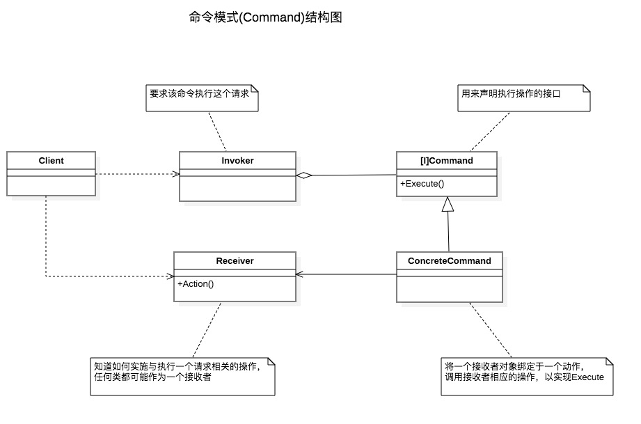

#命令模式

命令模式(Command Pattern):将一个请求封装为一个对象，从而让我们可用不同的请求对客户进行参数化；对请求队列或者记录请求日志，以及支持可撤销的操作。命令模式是一种对象行为模式，
其别名为动作(Action)模式或事物(Transaction)模式;

命令模式可以将请求发送者和接收者完全解耦，发送者与接收者之间没有直接引用关系，发送请求的对象只需要知道如何发送请求，而不必知道如何完成请求。

命令模式中包含如下几个角色:
Command(抽象命令类):抽象命令类一般是一个抽象类或接口，在其中声明了用于执行请求的execute()等方法，通过这些方法可以调用请求接收者的相关操作。

ConcreteCommand(具体命令类):具体命令类是抽象命令类的子类，实现了在抽象命令类中声明的方法，它对应的具体的接收者对象，将接收者对象的动作绑定其中。在实现execute()方法时
将调用接收者对象的相关操作(Action).

Invoker(调用者):调用者即请求发送者，它通过命令对象来执行请求。一个调用者并不需要在设计时确定接收者，因此它只与抽象命令类存在关联关系。在程序运行时可以将一个具体命令对象
注入其中，在调用具体命令对象的execute()方法，从而实现间接调用请求接收者的相关操作。

Receiver(接收者):接收者执行与请求相关的操作，塔具体实现对请求的业务处理。

命令模式的本质是对请求进行封装，一个请求对应于一个命令，将发出命令的责任和执行命令的责任分割开。每一个命令都是一个操作：请求的一方发出请求要求执行一个操作；接收的一方收到请求，
并执行相应的操作。命令模式允许请求的一方和接收的一方独立开来，使得请求的一方不必知道接收请求的一方的接口，更不必知道请求如何被接收、操作是否被执行、何时被执行，以及是怎么被执行的。

命令模式的关键在于引入了抽象命令类，请求发送者针对抽象命令类编程，只有实现了抽象命令类的具体命令才与请求接收者相关联。在最简单的抽象命令类中只包含了一个抽象的execute()方法，
每个具体命令类将一个Receiver类型的对象作为一个实例变量进行存储，从而具体指定一个请求的接收者，不同的具体命令类提供了execute()方法的不同实现，并调用不同接收者的请求处理方法

  1. 主要优点

       命令模式的主要优点如下：

       (1) 降低系统的耦合度。由于请求者与接收者之间不存在直接引用，因此请求者与接收者之间实现完全解耦，相同的请求者可以对应不同的接收者，同样，相同的接收者也可以供不同的请求
       者使用，两者之间具有良好的独立性。

       (2) 新的命令可以很容易地加入到系统中。由于增加新的具体命令类不会影响到其他类，因此增加新的具体命令类很容易，无须修改原有系统源代码，甚至客户类代码，满足“开闭原则”的要求。

       (3) 可以比较容易地设计一个命令队列或宏命令（组合命令）。

       (4) 为请求的撤销(Undo)和恢复(Redo)操作提供了一种设计和实现方案。

 

   2. 主要缺点

       命令模式的主要缺点如下：

       使用命令模式可能会导致某些系统有过多的具体命令类。因为针对每一个对请求接收者的调用操作都需要设计一个具体命令类，因此在某些系统中可能需要提供大量的具体命令类，这将影响
       命令模式的使用。

 

   3. 适用场景

      在以下情况下可以考虑使用命令模式：

       (1) 系统需要将请求调用者和请求接收者解耦，使得调用者和接收者不直接交互。请求调用者无须知道接收者的存在，也无须知道接收者是谁，接收者也无须关心何时被调用。

       (2) 系统需要在不同的时间指定请求、将请求排队和执行请求。一个命令对象和请求的初始调用者可以有不同的生命期，换言之，最初的请求发出者可能已经不在了，而命令对象本身仍然是
       活动的，可以通过该命令对象去调用请求接收者，而无须关心请求调用者的存在性，可以通过请求日志文件等机制来具体实现。

       (3) 系统需要支持命令的撤销(Undo)操作和恢复(Redo)操作。

       (4) 系统需要将一组操作组合在一起形成宏命令。

