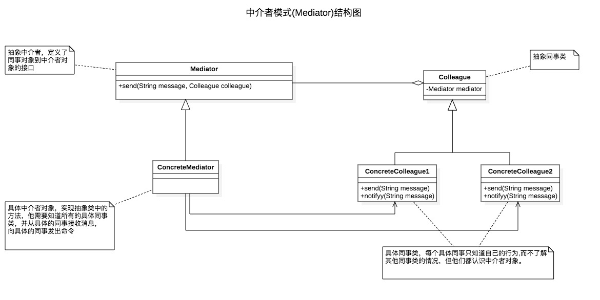

#中介者模式(Mediator)

中介者模式(Mediator)用一个中介对象来封装一系列的对象交互。中介者使各对象不需要显式的互相引用。从而使其耦合松散，而且可以独立的改变他们之间的交互。

中介者模式很容易在系统中应用，也很容易在系统中误用。当系统出现了'多对多'交互复杂对象群时，不要急于使用中介者模式，而要先反思你的系统在设计上是不是合理。

中介者模式的优点是Mediator的出现减少了各个Colleague的耦合，使得可以独立的改变和复用各个Colleague类和Mediator。其次由于把对象如何协作进行了抽象，将中介
作为一个独立的概念并将其封装在一个对象中，这样关注的对象就从对象各自本身的行为转移到他们之间的交互上来。

中介者模式一般应用于一组对象以定义良好但是复杂的方式进行同行的场合。以及想定制一个分布在多个类中的行为，而又不想生成太多子类的场合。